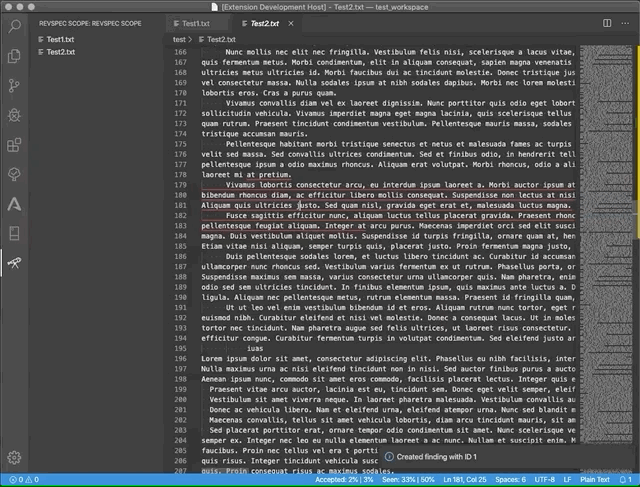

# Revspec

This open source VSCode extension is designed to support source code reviews. It does not contain a code analyzer, it is "only" a support for manual reviews.

## Features

* Add/Remove files to scope
* Add/Delete findings, containing:
  * Title
  * Description
  * Likelihood and Severity
* Automatic report generation, containing:
  * Overall stats (Seen code, Accepted code, …)
  * Scope
  * Findings sorted by importance

### Setting up a review session

### Manage files in review scope

### Automatic logging of viewed code and explicitly accepted code

### Create findings

### View existing findings

### Generate report in markdown format

## Known Issues

* The text fields in the findings dialog are not really suited for longer text.
* It's not possible to modify a finding after its creation.
* The review session is non-permanent

## Next sprint
> This may take until June 2020.
* Fixing the finding dialog
* Permanent session

---

Extension svg:

Icons made by <a href="https://www.flaticon.com/authors/kiranshastry" title="Kiranshastry">Kiranshastry</a> from <a href="https://www.flaticon.com/" title="Flaticon">www.flaticon.com</a>
